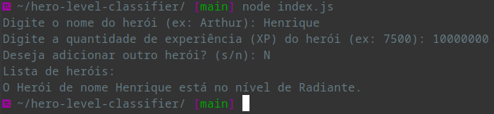

# 🌟 Classificador de Nível de Herói

**Este projeto classifica heróis com base na quantidade de experiência (XP) que possuem.** O programa solicita ao usuário o nome do herói e sua XP, determinando o nível correspondente.

---

## 📋 Pré-requisitos

Antes de executar o projeto, você precisa ter o **Node.js** instalado em seu sistema. Este guia é focado em **Manjaro Linux**. Para instalar o Node.js, execute o seguinte comando no terminal:

```bash
sudo pacman -S nodejs npm
```

---

## 🚀 Instalação

Siga os passos abaixo para configurar o projeto em **Manjaro Linux**:

1. **Clone o repositório**:

   ```bash
   git clone git@github.com:henriquejsza/hero-level-classifier.git
   ```

2. **Navegue até o diretório do projeto**:

   ```bash
   cd hero-level-classifier
   ```

3. **Instale as dependências do projeto**:

   ```bash
   npm install
   ```

---

## 💻 Como Executar o Projeto

Para executar o classificador de heróis, utilize o seguinte comando:

```bash
node index.js
```

### 🛠️ Instruções

- Ao executar o comando, o programa solicitará que você insira o **nome do herói**.
- Em seguida, será solicitado que você forneça a **quantidade de experiência (XP)** do herói.
- O programa exibirá o **nível do herói** com base na XP informada.
- Você pode continuar adicionando heróis ou sair do programa quando desejar.

---

## 📊 Exemplo de Saída Esperada

Após inserir os dados, a saída será semelhante a esta:

```plaintext
Digite o nome do herói (ex: Arthur): Henrique
Digite a quantidade de experiência (XP) do herói (ex: 7500): 10000
O Herói de nome Henrique está no nível de Imortal.
Deseja adicionar outro herói? (s/n): n
Lista de heróis:
O Herói de nome Henrique está no nível de Imortal.
```

---

## 🖼️ Imagem de Saída Esperada



---

## 🤝 Contribuição

Contribuições são bem-vindas! Sinta-se à vontade para abrir problemas (issues) e solicitar recursos (pull requests).